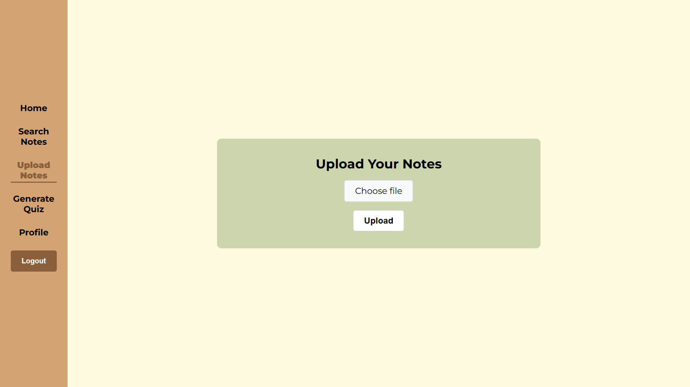
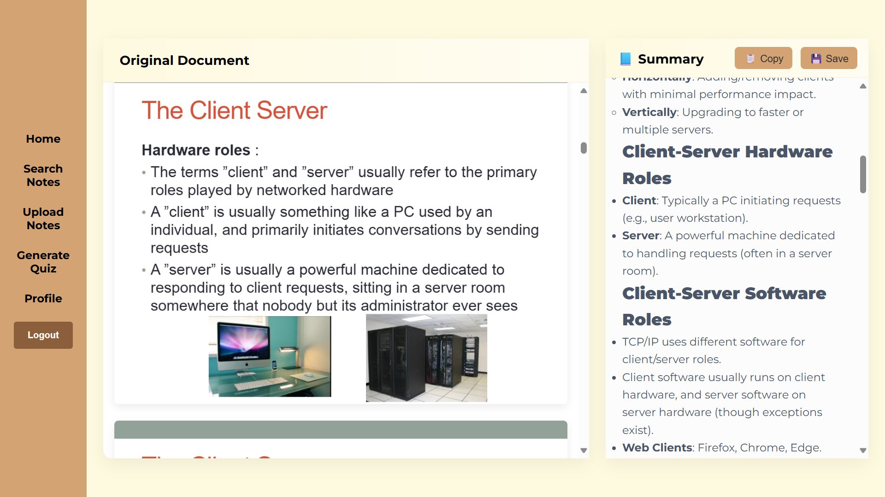
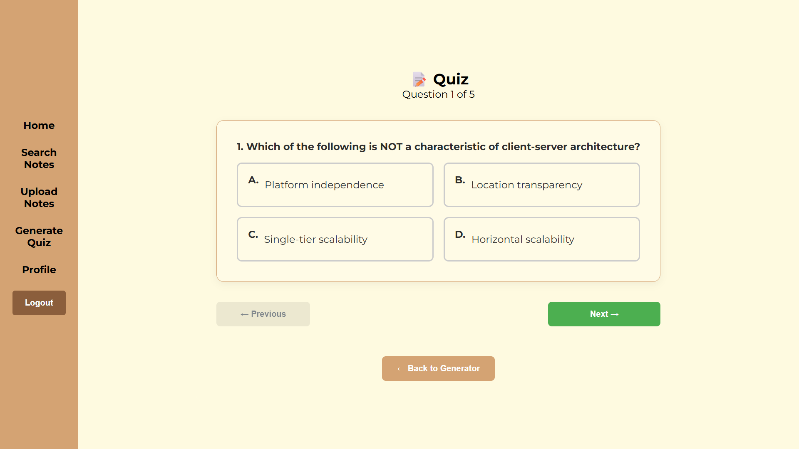
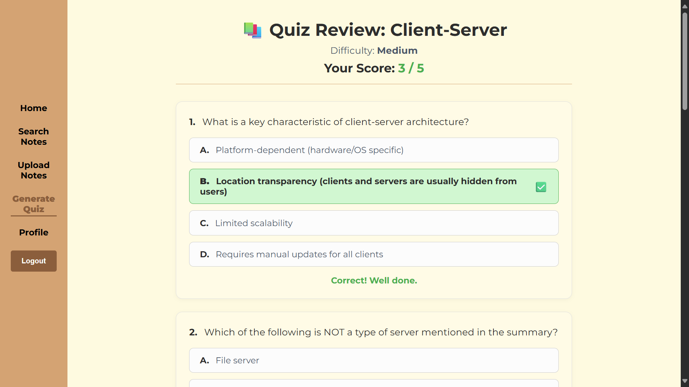

# 📘 AI-Powered Tutoring System — README

> A student-centered, **AI-powered tutoring system** to help learners study more efficiently by organizing notes, generating summaries, and creating interactive quizzes.

🎓 **AI-Powered Tutoring System** is a full-stack web application designed to tackle real-world academic challenges like managing large volumes of theoretical content, limited revision time, and inefficient learning strategies. Built with modern technologies and powered by the **DeepSeek API**, this system allows students to upload their materials, generate AI-based summaries and quizzes and track progress across subjects.

---

## 🔑 Key Features

- ✅ **Secure User Authentication**: Register and log in to access your personal data
- 📁 **Note Upload Support**: Upload `.pdf`, `.txt`, and `.pptx` files for processing
- 🧠 **AI Summarization**: Get concise, structured summaries using DeepSeek
- 🧪 **Interactive Quiz Generation**: Generate multiple-choice quizzes from your notes
- 📊 **Performance Tracking**: Review quiz results and monitor progress over time
- 📚 **Personal Library**: Save and organize notes you’ve uploaded or saved from others
- 🔍 **Search & Recommendation Engine**: Find notes by subject/topic or get related ones based on what you're studying
- 🌐 **Responsive UI**: Works seamlessly across desktop and mobile devices

---

## ⚙️ Technology Stack

### 🖥️ Frontend (React.js)

- React functional components + hooks (`useState`, `useEffect`, `useContext`)
- React Router DOM v6+ for navigation
- Axios for secure API communication
- React-Markdown for rendering AI-generated summaries
- React-PDF for viewing PDFs directly in-browser
- CSS Modules for scoped styling
- Global loading overlay via custom context provider

### 🛠️ Backend (Node.js + Express)

- RESTful API built with Express.js
- PostgreSQL as relational database
- Multer for file uploads and text extraction
- JWT for authentication and session security
- OpenAI-compatible client for DeepSeek integration
- File conversion utilities for PPTX → PDF handling

### 🗃️ Database Structure

- `users`: stores account info and login credentials
- `notes`: holds note metadata, summary, and file path
- `quiz_scores`, `quiz_questions`, `user_answers`: tracks quiz sessions and performance
- `saved_notes`: manages user-specific note library

---

## 📦 Installation Guide

### 🧰 Prerequisites

- Node.js (v16 or higher) installed
- PostgreSQL running locally or hosted
- DeepSeek API key for AI processing
- Git for version control

### 🚀 Setup Instructions

#### 1. Clone the Repository

```bash
git clone https://github.com/your-username/ai-powered-tutoring-system.git
cd ai-powered-tutoring-system
```

#### 2. Setup Backend

```bash
cd backend
npm install
cp .env.example .env
```

Update your `.env` file with:

```env
DATABASE_URL=postgres://localhost:5432/studysphere
JWT_SECRET=your-secret-key-here
DEEPSEEK_API_KEY=your-deepseek-api-key
PORT=5000
BASE_URL=http://localhost:5000
```

Then start the server:

```bash
npm run dev   # For development
npm start     # For production
```

#### 3. Setup Frontend

```bash
cd ../frontend
npm install
npm start
```

Make sure your `.env` file contains:

```env
REACT_APP_API_URL=http://localhost:5000
```

---

## 🧾 Usage Instructions

1. **Register or Login** to access protected features
2. **Upload your academic notes** (PDF, TXT, PPTX)
3. **Generate AI summaries** automatically
4. **Save notes** with subject and topic tags
5. **Create quizzes** with customizable difficulty and number of questions
6. **Attempt quizzes** and receive instant feedback
7. **Review past attempts** and improve your understanding
8. **Explore recommendations** based on your current subject

---

## 📁 Project Structure Overview

```
project-root/
│
├── frontend/            # React-based user interface
│   ├── public/           # Static assets
│   └── src/             # Source code
│       ├── components/   # Reusable UI elements
│       ├── contexts/     # Context providers (e.g., LoadingContext)
│       ├── pages/        # Main views (Home, Upload, Quiz, etc.)
│       ├── api/          # API connection layer
│       ├── utils/        # Helper functions
│       └── styles/       # CSS modules and layout styles
│
└── backend/             # Node.js + Express API server
    ├── src/
    │   ├── controllers/  # Route handlers
    │   ├── routes/       # API endpoints
    │   ├── db.js         # PostgreSQL pool setup
    │   ├── middleware/   # Auth, error handling
    │   └── utils/        # Text extraction, summarization, quiz generation
    └── uploads/          # Storage for user-uploaded documents
```

---

## 📸 Screenshots

- 📎 Upload screen: Select a file and watch it get processed

  

- 📝 Summary preview: View AI-generated notes side-by-side with original

  

- 🧪 Quiz page: Take adaptive assessments based on your uploaded content

  

- 📊 Performance review: Track your progress and see areas to improve

  

---

## 🧩 Future Enhancements (PSM II / FYP II)

- 💬 Add voice synthesis for auditory learning
- 📱 Mobile app version using React Native or Flutter
- 📈 Introduce detailed analytics dashboard
- 🔄 Enable flashcard export and spaced repetition
- 🧮 Adaptive quiz difficulty based on performance history

---

## 📄 License

This project is licensed under the **ISC License** – a permissive open-source license suitable for academic use.

---

## 📚 Credits

- [React](https://reactjs.org/) – Modern, component-based UI framework
- [Node.js + Express](https://expressjs.com/) – Fast and scalable backend
- [PostgreSQL](https://www.postgresql.org/) – Reliable relational database
- [DeepSeek API](https://api.deepseek.com/) – For natural language processing
- [LibreOffice Convert](https://www.libreoffice.org/) – Used for PPTX to PDF conversion
- [Axios](https://axios-http.com/) – HTTP client for clean API calls
- [Toastify](https://fkhadra.github.io/react-toastify/) – In-app notifications
- [react-pdf](https://www.npmjs.com/package/react-pdf) – Document rendering
- [Git + GitHub](https://github.com/) – Version control and collaboration

---

> This project was developed as part of my Final Year Project (FYP) at **Universiti Teknikal Malaysia Melaka (UTeM)**, Faculty of Information and Communication Technology (FTMK), under the supervision of **TS. Dr. Lizawati Binti Salahuiddin**.

Made with ❤️ and a lot of coffee during late-night coding sessions.

---
